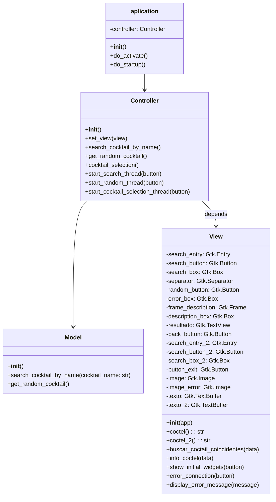
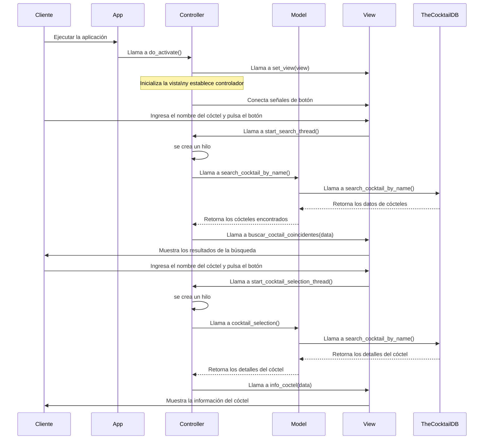
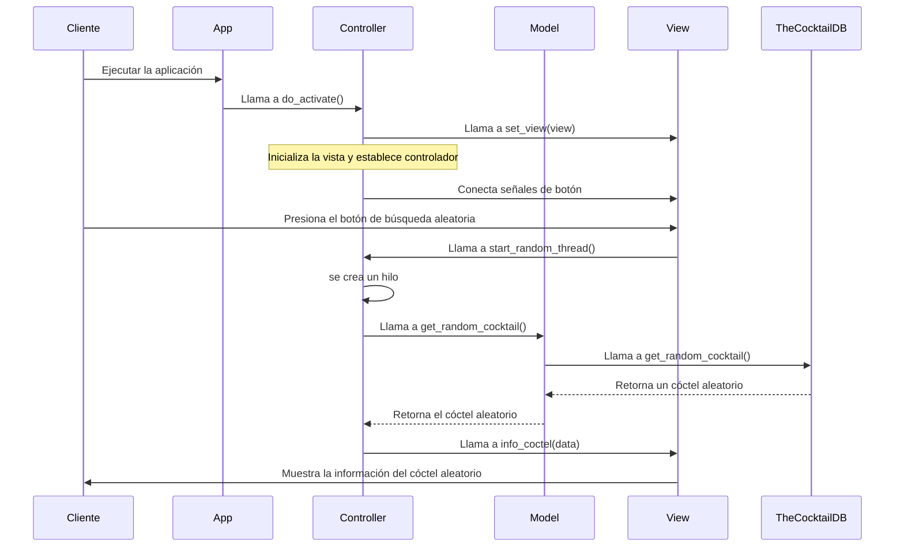

# Diseño software

En este documento, se presenta el diseño realizado en leguaje UML mediante Mermaid para los diagramas tanto de la parte estática como dinámica de la primera practica de la asignatura de Interfaz Persona Máquina.

##Diagrama de Clases

A contunuación se representa mediante un digrama de clases, las distinas clases que se emplean. Este diagrma representa la parte estática.

##Diagramas de flujo:

Los siguentes diagrmas de secuencia representa la parte dinámica del proyecto. 

A continuación se muestra uno de los casos de uso de la aplicación, el caso de busqueda. 

y el siguiente muestra el otro caso de uso, el caso de busqueda random:

##Conclusiones:

Este documento proporciona una visión general de tanto la parte estática como dinámica del proyecto, todo expuesto mediante diagrmas UML para facilitar su entendimiento.
